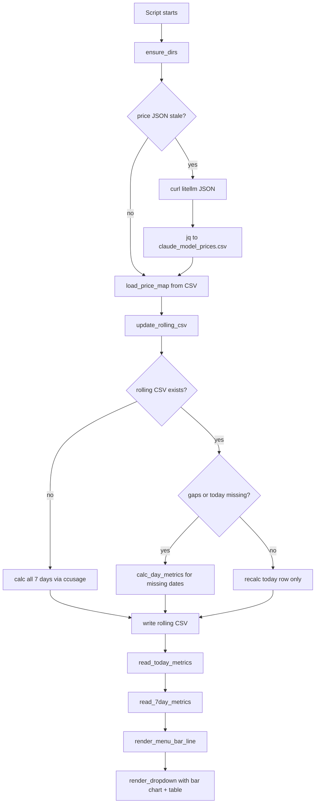
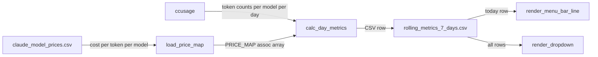

# Plan: claude_token_usage.1m.sh SwiftBar Widget Script

## Key Decisions
- Pricing data is fetched from litellm's GitHub JSON, parsed into a local CSV, and cached for 24 hours.
- ccusage provides token counts only; all cost math is done in the script using bc float arithmetic.
- The rolling 7-day CSV is the canonical store; ccusage is always called to refresh today's row.
- Display formatting (K suffix, % ratios, $ cost) is done purely in the render section.
- All file paths are derived from SCRIPT_DIR so the script is self-contained and relocatable.

## Assumptions
- ccusage is on PATH (installed via brew per setup_with_brew.sh).
- jq and bc are available (standard on macOS with Homebrew).
- The script runs with the cwd set by SwiftBar to the script's directory.
- SwiftBar renders stdout line-by-line; the first line is the menu bar item, lines after `---` are the dropdown.

## Risks and Open Questions
- litellm's JSON schema may change; the jq filter must be defensive against null fields.
- ccusage's JSON schema should be validated; if .daily or .modelBreakdowns is absent the script must not crash.
- bc requires explicit scale setting for sub-cent costs (token costs are typically in millionths of a dollar).
- date -v is macOS-only; no GNU date fallback needed, but must be noted.

---

## Script Sections (in order)

### 1. Shebang and SwiftBar metadata
- `#!/bin/bash`
- SwiftBar metadata comment block: `# <bitbar.title>`, `# <bitbar.version>`, `# <bitbar.author>`, `# <bitbar.desc>`

### 2. Strict mode and PATH setup
- `set -euo pipefail` — fail fast on errors, unset vars, and pipe failures.
- Prepend Homebrew bin paths (`/opt/homebrew/bin:/usr/local/bin`) to PATH so jq, bc, ccusage are found when SwiftBar runs the script outside a login shell.

### 3. Constants and directory setup
- `SCRIPT_DIR` — absolute path derived from `$0` using `$(cd "$(dirname "$0")" && pwd)`.
- `PRICE_DIR="$SCRIPT_DIR/../price"` — where pricing files live.
- `DATA_DIR="$SCRIPT_DIR/../data"` — where rolling CSV lives.
- `PRICE_JSON="$PRICE_DIR/model_prices_and_context_window.json"`
- `PRICE_CSV="$PRICE_DIR/claude_model_prices.csv"`
- `ROLLING_CSV="$DATA_DIR/rolling_metrics_7_days.csv"`
- `ROLLING_CSV_HEADER` — the expected header string.
- `MAX_DAYS=7`
- `bc` scale constant: `BC_SCALE=10` — enough precision for per-token costs.

### 4. Helper functions

#### `ensure_dirs()`
- Creates `$PRICE_DIR` and `$DATA_DIR` if they do not exist.

#### `fetch_pricing_if_stale()`
- If `$PRICE_JSON` does not exist or its mtime is older than 24 hours: curl the litellm URL into `$PRICE_JSON`.
- Regenerate `$PRICE_CSV` from `$PRICE_JSON` using the jq filter from the spec, removing any prior CSV.
- On curl failure: if `$PRICE_JSON` already exists keep it (stale but usable); if it does not exist return error code 1.

#### `load_price_map()` → populates associative array `PRICE_MAP`
- Signature: `load_price_map` (no args; populates global `declare -A PRICE_MAP`).
- Reads `$PRICE_CSV` line by line; parses 5 fields: model, cc_cost, cr_cost, in_cost, out_cost.
- Stores as `PRICE_MAP["$model,cc"]`, `PRICE_MAP["$model,cr"]`, `PRICE_MAP["$model,in"]`, `PRICE_MAP["$model,out"]`.
- Uses `tr -d '"'` to strip CSV quoting from jq @csv output.
- Edge case: skip lines where model field is empty.

#### `get_price()` → stdout
- Signature: `get_price "$model" "$type"` where type is cc|cr|in|out.
- Looks up `PRICE_MAP["$model,$type"]`; if missing or empty, prints `0` and logs a warning to stderr.

#### `fetch_ccusage_for_date()` → stdout JSON array
- Signature: `fetch_ccusage_for_date "$date_yyyymmdd"`
- Calls ccusage with `--since "$date" --until "$date" --json --breakdown`.
- Pipes through jq to extract the per-model breakdown array (as shown in spec).
- Returns empty array `[]` if ccusage fails or .daily is empty.
- Wraps the ccusage call in a subshell with `|| true` so a non-zero exit doesn't abort the script under `set -e`.

#### `calc_day_metrics()` → stdout CSV row
- Signature: `calc_day_metrics "$date_yyyymmdd"`
- Calls `fetch_ccusage_for_date`.
- For each model entry in the JSON array: looks up prices, multiplies token counts by price using bc, accumulates 8 running totals (4 counts + 4 costs).
- Uses `jq -r` to iterate; bc for all float arithmetic with `scale=$BC_SCALE`.
- Returns a single CSV row: `date,total_input_count,total_input_cost,total_cc_count,total_cc_cost,total_cr_count,total_cr_cost,total_output_count,total_output_cost`.
- Edge case: if JSON array is empty, returns a zero-filled row for that date.
- Edge case: jq null values for token counts are coerced to 0.

#### `update_rolling_csv()`
- Reads `$ROLLING_CSV` (if it exists) into a bash array of lines (excluding header).
- Determines today's date and the 7-day window (today back 6 days).
- Builds the new CSV top-down:
  1. Header row.
  2. For each date from today back to today-6:
     - If date is today: always recalculate via `calc_day_metrics`.
     - If date exists in old CSV: reuse that row.
     - If date is missing from old CSV: calculate via `calc_day_metrics` (gap fill).
  3. Writes result back to `$ROLLING_CSV` atomically (write to tmp, then mv).
- Edge case: if old CSV has no header or is malformed, treat it as non-existent.
- Edge case: rows older than 7 days are simply not included in the new write.

#### `read_today_metrics()` → sets global vars
- Reads the first data row of `$ROLLING_CSV` (line 2).
- Sets: `TODAY_DATE`, `TODAY_INPUT_COUNT`, `TODAY_INPUT_COST`, `TODAY_CC_COUNT`, `TODAY_CC_COST`, `TODAY_CR_COUNT`, `TODAY_CR_COST`, `TODAY_OUT_COUNT`, `TODAY_OUT_COST`.
- Edge case: if file has only a header or is missing, sets all to 0.

#### `read_7day_metrics()` → sets global vars
- Reads all data rows of `$ROLLING_CSV`.
- Sums each column across all rows.
- Sets: `WEEK_INPUT_COUNT`, `WEEK_INPUT_COST`, `WEEK_CC_COUNT`, `WEEK_CC_COST`, `WEEK_CR_COUNT`, `WEEK_CR_COST`, `WEEK_OUT_COUNT`, `WEEK_OUT_COST`, `WEEK_TOTAL_COST`.

#### `format_k()` → stdout
- Signature: `format_k "$count"`
- Divides by 1000 with one decimal place using bc, appends `k`. E.g. `15234` → `15.2k`.
- If value < 1000, prints as-is with no suffix (or `0.0k` — decide during impl).

#### `format_pct()` → stdout
- Signature: `format_pct "$numerator" "$denominator"`
- Returns integer percent using bc. Guards against divide-by-zero (denominator=0 → `0%`).

#### `format_cost()` → stdout
- Signature: `format_cost "$cost_bc_value"`
- Formats to 2 decimal places with `$` prefix. E.g. `0.04521` → `$0.05`.

#### `render_bar_chart()` → stdout
- Signature: `render_bar_chart` (reads `$ROLLING_CSV`).
- Reads up to 7 data rows from the rolling CSV.
- Finds max total_cost across all days for scaling.
- For each day (oldest to newest), prints one ASCII bar line:
  - Format: `YYYY-MM-DD |████░░░░░░| $0.xx`
  - Bar width: 10 characters; filled blocks proportional to cost vs max.
  - Uses Unicode block character `█` for filled, `░` for empty.
- Edge case: if all costs are 0, render all empty bars.
- Edge case: single-day data renders a full bar for that day.

#### `render_menu_bar_line()` → stdout (first line SwiftBar reads)
- Computes total_count = cc + cr + in + out for today.
- Computes percentages via `format_pct`.
- Computes total_cost = cc_cost + cr_cost + input_cost + output_cost.
- Prints: `cc: #k(#%), cr: #k(#%), in: #k(#%), out: #k(#%), t: $#`

#### `render_dropdown()` → stdout (lines after `---`)
- Prints `---` separator.
- Prints bar chart section (label + chart lines).
- Prints blank separator line.
- Prints the 2-column table with today vs 7-day totals using fixed-width printf formatting.
  - Column headers: `Today` | `Last 7 Days`
  - Row 1: total cost
  - Row 2: cc counts
  - Row 3: cr counts
  - Row 4: in counts
  - Row 5: out counts

### 5. Error-state render functions

#### `render_error()` → stdout
- Signature: `render_error "$message"`
- Prints a minimal menu bar line indicating error state.
- Prints `---` and the error detail in the dropdown.
- Used when pricing file is missing or corrupt.

#### `render_no_data()` → stdout
- Prints "No data available" as the menu bar line and dropdown.
- Used when ccusage fails and no historical CSV exists.

### 6. Main execution block

```
main() {
  ensure_dirs
  fetch_pricing_if_stale  || { render_error "Pricing file unavailable"; exit 0; }
  load_price_map          || { render_error "Pricing data corrupt"; exit 0; }
  update_rolling_csv
  read_today_metrics
  read_7day_metrics
  render_menu_bar_line
  render_dropdown
}
main
```

---

## Data Flow Diagram





---

## Edge Cases to Handle Explicitly

| Scenario | Handling |
|---|---|
| ccusage not on PATH | Wrap call in subshell; on failure use last known CSV row or render_no_data |
| ccusage returns empty .daily | fetch_ccusage_for_date returns [] ; calc_day_metrics emits zero row |
| Model in ccusage not in price CSV | get_price returns 0; warn to stderr |
| Price JSON null fields | jq select guards; bc receives 0 for null |
| Rolling CSV missing or header-only | Treat as non-existent; regenerate all 7 days |
| Rolling CSV has future dates | Skip rows outside the 7-day window |
| All 7 days have zero cost | Bar chart renders all empty bars without divide-by-zero |
| bc receives empty string | All bc inputs guarded with ${var:-0} before arithmetic |
| SwiftBar runs outside login shell | PATH explicitly includes /opt/homebrew/bin and /usr/local/bin |
| Fractional token counts from jq null | jq // 0 coercion on every token field |

---

## macOS / bash Gotchas

- **bc float math**: Always set `scale=N` before division. Multiplication does not need scale. Addition of bc results may produce trailing zeros — use `printf %.2f` for display.
- **date -v syntax**: `date -v-6d +%Y%m%d` for 6 days ago; `date -v-0d` is today. No GNU date.
- **Associative arrays**: Require `declare -A`; not available in bash 3 (macOS ships bash 3.2). Must verify Homebrew bash 5 is used, or avoid associative arrays and use a simpler key lookup (e.g. grep-based). **Recommendation**: use `#!/usr/bin/env bash` and target `/opt/homebrew/bin/bash` (bash 5) explicitly, or replace `declare -A` with a flat-file lookup.
- **jq @csv output**: Wraps strings in double quotes; strip with `tr -d '"'` when parsing back.
- **SwiftBar cwd**: SwiftBar may not set cwd to the script directory; always use `$SCRIPT_DIR`-derived absolute paths.
- **set -e and subshells**: `command || true` is needed for commands that may legitimately return non-zero inside `set -e`.
- **Atomic file writes**: Write rolling CSV to a `.tmp` file first, then `mv` to final path to avoid half-written files if the script is interrupted.
- **printf vs echo**: Use `printf` for all formatted output to avoid escape sequence issues with `-e`/`-n` on macOS's `/bin/echo`.

---

## File Layout After Implementation

```
src/
  claude_token_usage.1m.sh   ← the script
price/
  model_prices_and_context_window.json   ← cached, updated every 24h
  claude_model_prices.csv                ← regenerated when JSON updates
data/
  rolling_metrics_7_days.csv            ← rolling 7-day store
```
